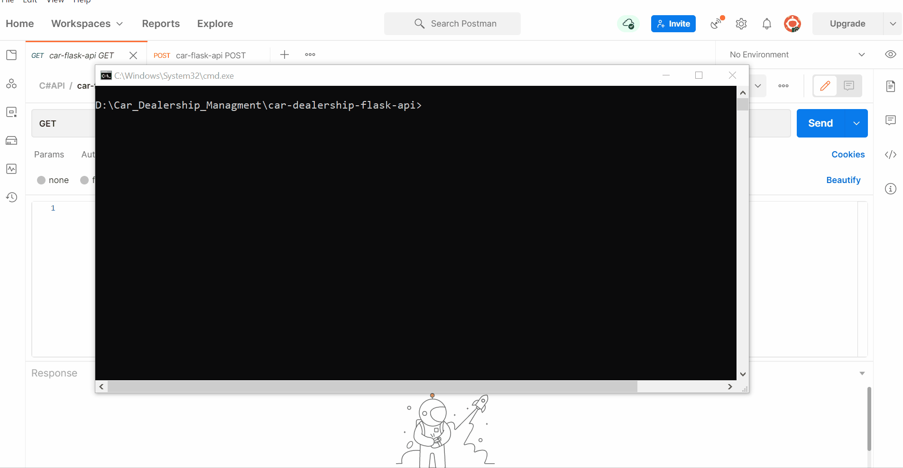
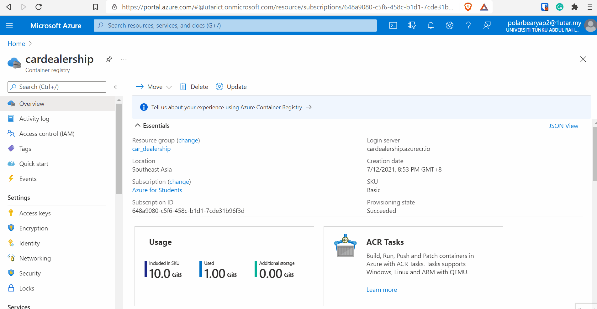

# car-dealership-flask-api
- A Docker container for deployment of Python production-ready ML model using Flask. 
- A proof of concept/simple prototype for ML model deployment in Azure.
- **Important**: Note that another [repository](https://github.com/polarBearYap/car-dealership-automl) is the foundation for this repository. This repository is foucsed on model deployment and another one is focused on model training. Be sure to check out both.

## Table of Contents
* [Project Details](#Project-Details)
* [Demo](#Demo)
* [Folder Structure](#Folder-Structure)
* [Learning Purpose](#Learning-Purpose-)
* [Technology Applied](#Technology-Applied-)
* [Software Requirement](#software-requirement-windows-10-environment-)
* [Local Setup (Windows 10 Environment)](#local-setup-windows-10-environment-)
* [Deploy Docker image to Azure](#Deploy-Docker-image-to-Azure)
* [Technical Contributions](#Technical-Contributions)
* [Learning Lessons](#Learning-Lessons)
* [Credits](#Credits)

## Project Details
1. Contain 2 Endpoints:
    - /api/v1/car_price/prediction (POST): Given an input features, return the prediction result.
    - /api/v1/car_price/global_feature_importance (GET): Return global feature importance for the raw features and preprocessed features.

## Demo
1. Demo for car dealership Flask API (Local deployment)
    - 

2. Demo for car dealership Flask API (Azure deployment)
    - 

## Folder Structure
- `car_dealership` folder contains flask application.
- `resources` folder contains input for testing, delete this folder when building Docker image.

## Learning Purpose &#128218;
- To learn how to build Python &#128013; production-ready model using Docker.
- To learn how to deploy built Docker image to Azure Web App.
- To get my hands dirty in DevOps &#128521;.

## Technology Applied &#129302;
- [Docker](https://www.docker.com/): To containerise the API since there is many Python dependencies, why not just bundle it up.
- [Flask](https://flask.palletsprojects.com/en/2.0.x/): For building API to allow access to trained models.
- [Azure AutoML](https://docs.microsoft.com/en-us/azure/machine-learning/concept-automated-ml): Auto optmization of machine learning models without even trying &#129315;.

## Software Requirement (Windows 10 Environment) &#128187;
- Windows Edition
- [Docker Desktop on Windows](https://docs.docker.com/docker-for-windows/install/)
- Visual Studio 2019 Community Version: To develop the API and manage Python dependencies
- Azure free account (Poor man choice &#129299;)

> Tips &#128161;: For installing Docker Desktop in Windows, I personally recommended to setup WSL 2 backend instead of setting up Hyper-V backend and Windows containers.
The setup steps for first option is available in this [MS docs](https://docs.microsoft.com/en-us/windows/wsl/install-win10). The latter option requires [Hypervisor](https://docs.microsoft.com/en-us/answers/questions/29175/installation-of-hyper-v-on-windows-10-home.html), which is not available in Windows Home Edition. However, you can try to [install Hypervisor in Windows Home Edition](https://www.itechtics.com/enable-hyper-v-windows-10-home/).

## Local Setup (Windows 10 Environment) &#x2699;

1. Download the source code from GitHub.

2. Open cmd in the code folder.

3. Assuming that you have installed Docker Desktop, execute the command:
    - `docker build -t car_dealership_api:latest`

4. If the build is successful, execute the command:

    - `docker run -p 4000:80 car_dealership_api:latest`
    - This will run the built Docker container in localhost:4000. You can define any open ports that you like.
    - Try to navigate to http://locahost:4000/api/v1/car_price/global_feature_importance to see if any JSON is returned.

## Deploy Docker image to Azure

1. Follow the intructions in this [MS docs](https://docs.microsoft.com/en-us/azure/container-registry/container-registry-get-started-portal#create-a-container-registry) to create an Azure container registry. 

2. Before proceeding to host the Docker container, try to pull the image and see if everything works.

    - `az acr login`
    - `docker run -p 4000:80 <container-registry-login-server-url>/<repo-name>:<your-current-version-number>`
    - This will remotely pull the image to your local machine and run the built Docker container in localhost:4000.
    - Try to navigate to http://locahost:4000/api/v1/car_price/global_feature_importance to see if any JSON is returned.

3. Follow the instructions in this [MS docs](https://docs.microsoft.com/en-us/azure/devops/pipelines/apps/cd/deploy-docker-webapp?view=azure-devops&tabs=python) to create an Web App to host Docker container.

4. Enjoy your Docker-containerised Python Flask API hosted in Azure!!! Congrats &#127881;&#127870;&#127882;

## Technical Contributions
1. Define a requirements.txt for the Python environment for Azure AutoML inference.
2. Define a docker image for the deployment of Azure AutoML model. 

## Learning Lessons

- You are going to encounter numerous errors and bugs during deployment. But that's part of the process. I spend like 5 weeks in figuring out how things work from creating API using Flask to building the Docker image. 

## Credits
1. Stack Overflow Community

2. [ONNX Runtime for Azure ML](https://hub.docker.com/_/microsoft-azureml-onnxruntimefamily). I use `mcr.microsoft.com/azureml/onnxruntime:latest` as the base image of the Docker deployment.

3. My university UTAR. For renewing my free $100 Azure credit yearly. However, I almost used finish already due to inexperience &#128546;.
